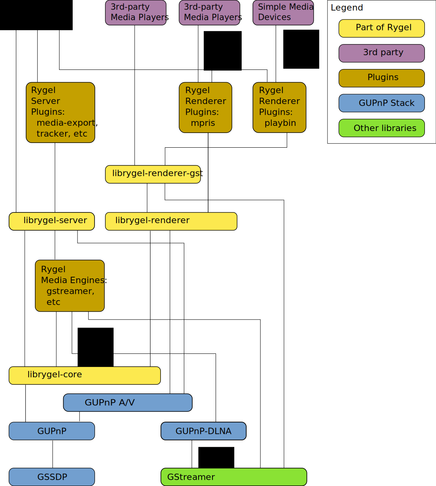

.. SPDX-License-Identifier: LGPL-2.1-or-later

============
Architecture
============

Relevant UPnP Standards
=======================

Rygel implements the following UPnP specificaions and optional devices and services:

* `MediaServer:3 <http://www.wikipedia.org/wiki/Media_server>`_ in `version 3 of the specification <http://upnp.org/specs/av/UPnP-av-MediaServer-v3-Device.pdf>`_
* `MediaRenderer:2 <http://www.wikipedia.org/wiki/Media_renderer>`_ in `version 2 <http://upnp.org/specs/av/UPnP-av-MediaRenderer-v2-Device.pdf>`_.
* BasicManagement:2, see `the UPnP.org specification for BasicManagement <https://upnp.org/specs/dm/UPnP-dm-BasicManagement-v2-Service.pdf>`_
* EnergyManagement:1, see `the UPnP.org specification for EnergyManagement <https://upnp.org/specs/lp/UPnP-lp-EnergyManagement-v1-Service.pdf>`_
* RemoteUIServer:1, see `the UPnP.org specification for Remote UI <https://upnp.org/specs/rui/UPnP-rui-RemoteUIServer-v1-Service.pdf>`_

Block diagram
=============

Program flow
============

The following sections describe the interaction of Rygel's parts during UPnP operations.

Startup
-------

At startup, Rygel performs the following steps:

* Prepares `RygelMetaConfig <https://gnome.pages.gitlab.gnome.org/rygel/reference/gtkdoc/librygel-core-RygelMetaConfig.html>`_, for later use, adding specific Configuration implementations that get the information from:

  * Environment variables
  * Command line options
  * The configuration file

* Sets up UNIX signal handlers to allow clean shutdown, sending ``SSDP BYEBYE`` messages on ``SIGINT`` or ``SIGTERM``.
* Acquires the D-Bus name to ensure only one instance of the Rygel executable is running. If another instance is blocking the name it is shut down.
* Creates an UPnP context manager (`GUPnPContextManager <https://gnome.pages.gitlab.gnome.org/gupnp/docs/class.ContextManager.html>`_) to watch for appearing/disappearing network devices.

  * For each network device, the context manager provides a context (`GUPnPContext <https://gnome.pages.gitlab.gnome.org/gupnp/docs/class.Context.html>`_).
  * For each context, Rygel creates a `RygelRootDeviceFactory <https://gnome.pages.gitlab.gnome.org/rygel/reference/gtkdoc/librygel-core/librygel-core-RygelRootDeviceFactory.html>`_.

* Creates the plugin loader (`RygelPluginLoader <https://gnome.pages.gitlab.gnome.org/rygel/reference/gtkdoc/librygel-core/librygel-core-RygelPluginLoader.html>`_).
* Starts loading plugins.

  * For every plugin, iterate over the `RygelRootDeviceFactories <https://gnome.pages.gitlab.gnome.org/rygel/reference/gtkdoc/librygel-core/librygel-core-RygelRootDeviceFactory.html>`_)
    and create a `RygelRootDevice <https://gnome.pages.gitlab.gnome.org/rygel/reference/gtkdoc/librygel-core/librygel-core-RygelRootDevice.html>`_ for the plugin.
  * Each plugin should check whether it has been disabled in the configuration (`RygelMetaConfig <https://gnome.pages.gitlab.gnome.org/rygel/reference/gtkdoc/librygel-core-RygelMetaConfig.html>`_)
    and if so then it should disable itself. However, this system should be improved.

Network Devices Appearing
-------------------------

When a network device appears, Rygel is notified by the GUPnPContextManager and then:

* Checks if it should listen on this network interface by checking its configuration, via RygelMetaConfig.
* Creates a RygelRootDeviceFactory for the GUPnPContext.
* Iterates over the plugin list and creates a RygelRootDevice for each plugin from that factory.

Network Devices Disappearing
----------------------------

When a network device disappears, Rygel is notified by the GUPnPContextManager and then:

* Checks if it has a RygelRootDeviceFactory for that GUPnPContext.
* Drops the RygelRootDeviceFactory attached to the GUPnPContext
* Drop the RygelRootDevices attached to the GUPnPContext.

Browsing
--------

When a client application calls the UPnP Browse action on a Rygel server device, by sending a UPnP message, Rygel:

* Handles the "action-invoked::Browse" signal emitted by `GUPnPService <https://gnome.pages.gitlab.gnome.org/gupnp/docs/class.Service.html>`_, in RygelContentDirectory::on_browse().
* Creates a new instance of RygelBrowse, parsing the arguments and verifying the parameters of the call.
* The RygelBrowse instance will try to fetch the the object to be browsed from the RygelRootContainer passed in from the RygelContentDirectory using RygelMediaContainer.find_object().
* If the object is found, depending on the type of the browse, Rygel will either return the metadata of the object by serializing it directly or, if the object is a container, Rygel will get its children using RygelMediaContainer.get_children() and serialize the list of results.

Searching
---------

Searching is very similar to browsing. When a client application calls the UPnP Search action on a Rygel server device, by sending a UPnP message, Rygel:

* Handles the "action-invoked::Search" signal emitted by GUPnPService, in
  RygelContentDirectory::on_search().
* Creates a new instance of RygelSearch, parsing the arguments and verifying the parameters of the call.
* The RygelSearch instance will try to fetch the the object to be browsed from the RygelRootContainer passed in from the RygelContentDirectory using RygelMediaContainer.find_object().
* If the object is found, it will use RygelSearchableContainer.search() to execute the search query and serialize the returned list if any. The search is either implemented by the plugin or done by a recursive tree walk, using the default implementation in RygelSearchableContainer.simple_search().

Uploading
---------

Uploading is a two-step process. First an object needs to be created with the UPnP CreateObject call, then the data needs to be uploaded, either by using the ImportResource UPnP call, requiring the data to be available via HTTP, or by using HTTP POST, posting to the res@importURI returned by the CreateObject call.

When a client application calls the UPnP CreateObject action on a Rygel server device, by sending a UPnP message, Rygel:

* Handles the "action-invoked:CreateObject" signal emitted by GUPnPService.
* RygelContentDirectory creates a new instance of RygelItemCreator.
* RygelItemCreator parses the arguments and the passed DIDL-Lite description of the item into a GUPnPDIDLLiteItem to create using GUPnPDIDlLiteParser.
* It then fetches the parent container of the to-be-created item, checking various preconditions on that parent container such as:

  * Whether clients may create child items in this container (The Upload flag in the OCM flags).
  * Whether the class of the item to be created matches the ones allowed in the container.
  * If the container has the special DLNA.ORG_AnyContainer ID, it will use the RygelSearchableContainer.search() function to search for a suitable container to upload to.

* A RygelMediaItem is created from the DIDL-Lite item (GUPnPDIDLLiteItem) created previously and added to the container.
* The code waits (maximum 5 seconds) for the item to show up in the container, giving the backend time to add it.
* The item is serialized back to DIDL-Lite using GUPnPDIDlLiteWriter to be sent to the caller.
* If the container has the special ``DLNA.ORG_AnyContainer`` ID, the item is also scheduled for automatic removal in the RygelItemRemovalQueue after 35 seconds (as specified by DLNA) if no data upload happens.

Uploading with HTTP POST
^^^^^^^^^^^^^^^^^^^^^^^^
* The client receives a DIDL-Lite snippet from Rygel in the response of the CreateObject UPnP call containing a UPnP res node carrying an importURI attribute.
  (A res node describes a UPnP resource, such as a URI and some specific meta-data.)

  * The client uses HTTP POST to send data to the Rygel server's URI.

* RygelHTTPServer intercepts the HTTP POST call and creates an instance of RygelHTTPPost.
* RygelHTTPPost parses the passed URI using RygelHTTPItemURI and tries to find the prepared item using RygelMediaContainer.find_object().
* RygelHTTPPost does some sanity checks on the item, creates a temporary file to save the content to and connects to SoupMessage's "got-chunk" signal, writing the data chunks to the temporary file
* If the SoupMessage emits its "got-body" signal then the temporary file is moved to the real file.
* RygelHTTPPost waits for 5 seconds for the backend to analyze the file and update the item information.

Uploading with ImportResource
^^^^^^^^^^^^^^^^^^^^^^^^^^^^^
* The client receives a DIDL-Lite snippet with a res node carrying an importURI attribute
* The client makes the data to be imported available on a HTTP server and calls ImportResource with the local URI and the URI from importResource
* GUPnPService emits "action-invoked:ImportResource"
* RygelContentDirectory creates a new instance of RygelImportResource.
* RygelImportResource does some sanity checks on the URI and item
* RygelImportResource creates a HTTP GET request for the source URI, creates a file to save the content to and connects to the SoupMessage's "got-chunk" signal, writing the data chunks to the temporary file.
* If the SoupMessage emits its "got-body" signal then the operation is concluded.

Rendering
---------

In principle, rendering is the process of setting an URI to play and then calling play.

* The client calls SetAVTransportURI.
* GUPnPService emits "action-invoked:SetAVTransportURI"
* If the URI is HTTP or HTTPS, RygelAVTransport issues a HTTP HEAD request to query some DLNA parameters and the content-type from the DMS and check the URL for accessibility.
* If the URI is accessible and the content type is supported, URI and metadata will be set on the RygelPlayerController. If the URI is a playlist, RygelPlayerController parses the playlist and sets the content type and DLNA features of the first item on the player. Otherwise the content type as well as DLNA features are passed to the RygelMediaPlayer instance directly.
* The client calls Play.
* GUPnPService emits "action-invoked:Play".
* RygelAVTransport sets the playback state of the RygelMediaPlayer instance to "PLAYING".
